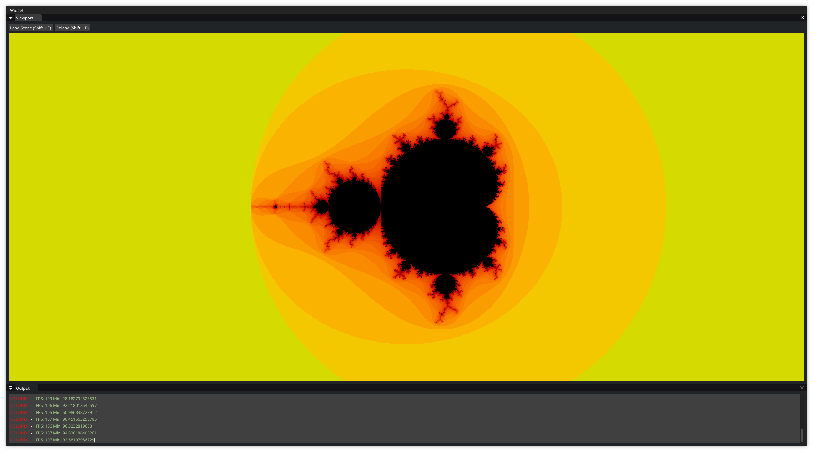
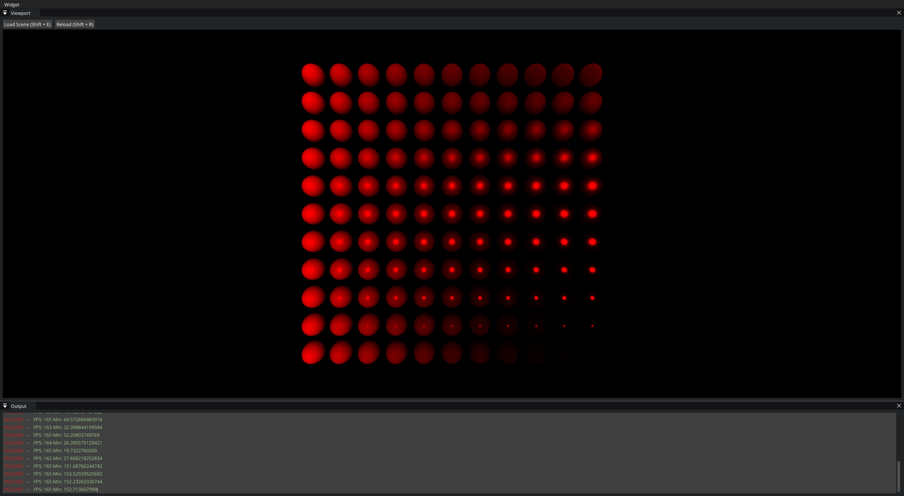

# Volund [](https://github.com/Kaj9296/Volund/blob/main/LICENSE)


Volund is a game engine written in C++ with Lua scripting for Windows and Linux.

***

**Keep in mind that Volund is currently in a very early stage of development and that these instructions may be incomplete.**

## Getting Started

To get started with Volund, it is recommended to use Visual Studio 2022 or gmake. Other toolsets may work, but are not officially tested. You will need to be using Windows or Linux to build Volund.

<ins>**1. Cloning (downloading) this repository**</ins>

To clone (download) this repository, you can use the ```Code``` button at the top left of the screen, or use the following command if you have git installed ```git clone --recursive https://github.com/Kaj9296/Volund```.

<ins>**2. Building Volund**</ins>

Building Volund is slightly different depending on whether you are on Windows or Linux.

**Windows**

If your on Windows, run the [premake.bat](https://github.com/Kaj9296/Volund-2/blob/main/premake.bat) file in the CMD with an argument specifying what toolset you wish to use. For example, if you wish to use Visual Studio 2022 then you would type ```premake.bat vs2022```.

**Linux**

If your on Linux, run the [premake.sh](https://github.com/Kaj9296/Volund-2/blob/main/premake.sh) file in the terminal with an argument specifying what toolset you wish to use. For example, if you wish to use gmake then you would type ```sh premake.sh gmake```.

After that, you can simply compile the generated project with your chosen tool set.

## Creating a Scene

In Volund a scene is simply any .lua file. In the future there will be an editor similar to other game engines, however for now you can simply write lua files manually. Some example files can be found down below and in the [examples](https://github.com/Kaj9296/Volund/tree/main/examples) folder.

## Running a Scene

Currently the only way to run a scene is to open the Editor (the executable that was generated using your chosen toolset in the previous step) and press ```CTRL + E``` this will open a file dialog from which you can select your desired scene.

<!---
## Test Scenes

The following are two of the scenes that can be found in the [examples](https://github.com/Kaj9296/Volund/tree/main/examples) folder.

**Mandelbrot.lua**



**PBR.lua [WIP]**


-->

## Contributing

Volund is open to contributions. There are currently no strict guidelines for contributing, so feel free to submit pull requests that you think are appropriate. If the project grows significantly in the future, a more standardized process for contributions may be implemented.

## Goals:

The main goal of the project is to create a game engine that allows for low level experimentation without the complexity of working on a low level.

- PBR 3D rendering
- Lua scripting
- C++ scripting
- Tools for shader development
- Windows and Linux Compatibility
- Feature complete editor
- Support for multiple graphics APIs for example OpenGL, DirectX and Vulcan.
